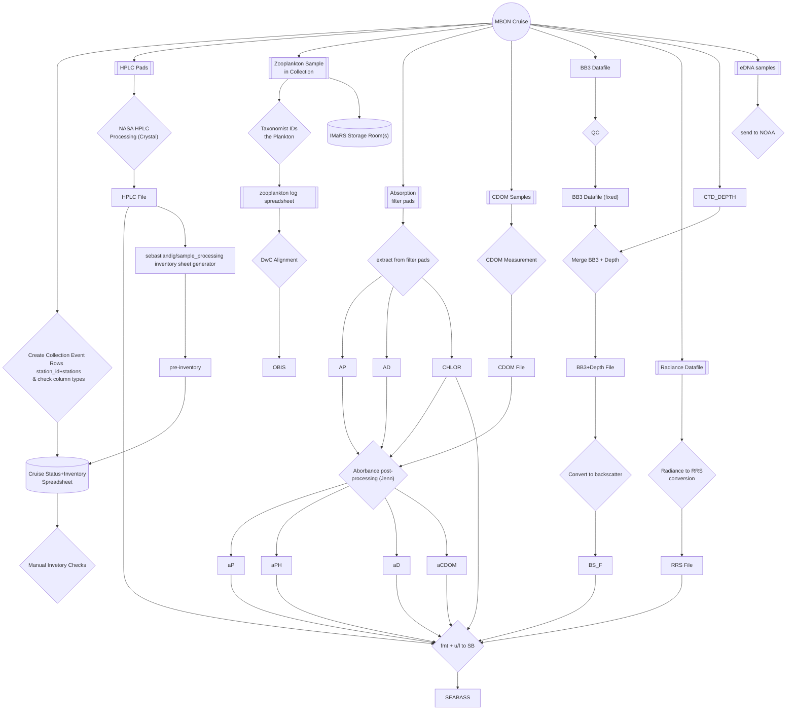

# IMaRS MBON cruises
MBON cruises taken in S FL starting in the 2016 and collections ongoing as of 2023.
2015 was a trial run, but funding began for the cruises in 2016.

Digna and Sebastian have created master spreadsheets to track this data that is stored in USF's box.com under mbon_imars_cruises.
Sebastian's spreadsheet is programmatically generated and focuses in on a subset of the data.
Digna's spreadsheet has been manually created and aims to give a broad overview of data status. 

Ian Smith has agreed that a shared data inventory is a good idea.

Data from 2016-2017 HPLC
One cruise from 2015
Duplicate from 2016
All from 2021-2023
Sebastian and Enrique 2015-2016 samples are missing.

HPLC from 2016 - 2020 plus on cruise from 2021 has been analyzed.

1 cruise from 2015, we have samples from. 
1 cruise from 2016 are only duplicates, the rest we have 2021 - 2023 in samples

Chris Kelble has data from before 2015.
Surface & CTD going back to 1998.

CAS data is processed through collab w/ GCOOS.

# Data
Much of this data is hosted on box.com; the effort of putting things there was done by Sebastian.
That data is [here]( https://usf.app.box.com/folder/179388329770 ).
The data was pulled out of Enrique's and Sebastian's home directory on IMaRS servers (yin.marine.usf.edu:/yin/homes/enrique;yin.marine.usf.edu:/yin/homes/sebastian).

Some helper scripts and be found at [USF-IMARS/mbon_cruise_scripts](https://github.com/USF-IMARS/mbon_cruise_scripts).

## Data Processing Pipeline:

Data collected includes :
* CDOM
* a_ph, a_nap, and chlorophyll 
  * all parameters come from the same sample
* HPLC 
  * phytoplankton pigment data, extracted and QA/QC by NASA, further processesing by Sebastian and Anna
* eDNA 
  * moved to NOAA AOML August 2022 and further crusies will also stay at NOAA.
* zooplankton microscopy 
  * changed between Jaime (pre-2018) and Natalia (2018 - 2020) 
    * Natalia's method is published. The published DwC data will have the protocol links.
    * Jaime's processed data: 
      * [published to OBIS](https://obis.org/dataset/afef5da2-614b-4208-aee6-c2413ed5ab76)
        * the dates are wrong as of 2023-01. See [this issue](https://github.com/USF-IMARS/zoo-taxonomy-to-darwin-core/issues/5).
* vessel flowthrough information 
  * NOAA AOML submits to NCEI
  * Parameters: pCO2, temperature, salinity, etc.
* GER data (i.e. Rrs)
  * Enrique will have info
* BB3
  * raw count data 
  * contact **Herardo** if he wants to process
* TODO: add missing data mentioned by Chris Kelble and Kelly Montenero here

For more information you can contact:
* Sebastian
* Enrique : especially for eDNA and GER/SVC 
* Digna
* Jenn : for instrument details

## CDOM
The labwork of CDOM data analysis may be transitioning to be done in Miami and managed by Enrique & AOML in 2023.
About 20 duplicate samples have been taken to verify that the results are the same when compared with existing methods. 
Some of these smaples were near-shore and others were offshore.

CDOM (wavelengths 200 to 800 nm) includes: abs_ag = gelbstoff (or CDOM) absorbance coefficient (averaged raw duplicate scans); ag = gelbstoff (or CDOM) absorption coefficient (null point corrected).

## Absorption Pads
Absorption Spectra (wavelengths 400 to 800 nm) includes: abs_ap = Optical density spectra of total particulates (unitless); abs_ad = Optical density spectra of detritus (unitless); ap = Absorption spectra of total particulates (units: 1/m); ad = Absorption spectra of detritus (units: 1/m).

## eDNA
Carolina and Anni in process of submitting eDNA occurrence data to OBIS (2023-03).
Luke Thompson and Enrique in Miami watching over the project.
Processed using OTU-based methods.
DwC data will be submitted using occurrence core with the DNA extension.
Carolina + Anni will be meeting weekly to push it forward.

## HPLC
### status (updated 2023-03)
HPLC sampled since 2015.
We have HPLC data for many cruises.
HPLC data has been sent to NASA SEABASS only from one cruise to 2016.

Sebastian found issues in HPLC metadata; Digna is working to clean it up and send to NASA SEABASS.
Sebastian has the data almost read to submit

## Phytoplankton
MBON phytoplankton pigment data was corrected using R.

## Spectral
We submit the radience, irradience, and reflectance to SEABASS.

AOML is starting to collect spectral data in 2023.
IMaRS's GER was last calibrated in 2012 and is owned by NOAA.
The overlap of RRS is fairly similar.
Magnitudes of raw radiance are different. 
Might be calibration errors, a units issue, or the program not taking into account integration time.
The SVC software does show the same units when comparing.
The GER is about 8x less than the measurement from the new SVC.
David (Dave) English is the expert at AOML to figure it all out, the plan is to test the instrument.

Sebastian gives the data to Enrique and he puts it in a google drive.
So long as AOML is taking scans then IMaRS does not need to.

## chlorophyll
In the box.com cruise main folder with name like `{year}_{month}_WS_abs.xlsx`.

# Ship Info
Most cruises are done on the R/V Walton Smith, two cruises used R/V Savannah, and one cruise used the R/V Weatherbird II.
 
* R/V Walton Smith (WS)
  * U Miami RASMES, Miami, FL
  * Most cruises
* R/V Savannah (SV)
  * Was docked in Miami for cruise
  * Skidaway Insititute of Oceanography, GA
  * Two cruises in early 2018
* R/V Weatherbird II (WB)
  * Florida Institute of Oceanography, St. Pete, FL
  * August 2022

# Submission Locations
Data from this cruise is being submitted to 
* SEABASS
  * a_ph
  * a_nap
  * a_CDOM
  * HPLC
  * GER
  * BB3
* OBIS
  * zooplankton
